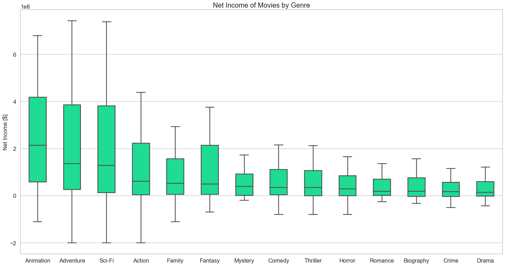
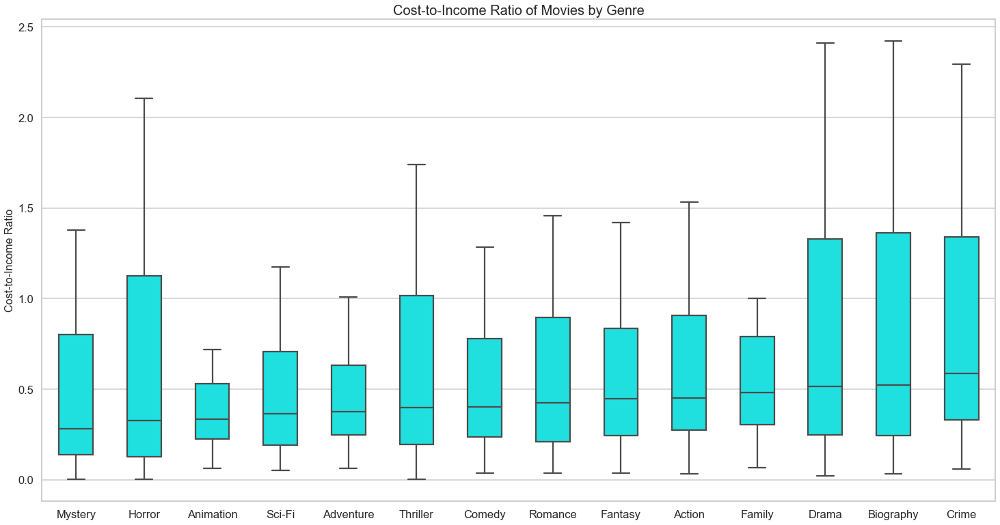
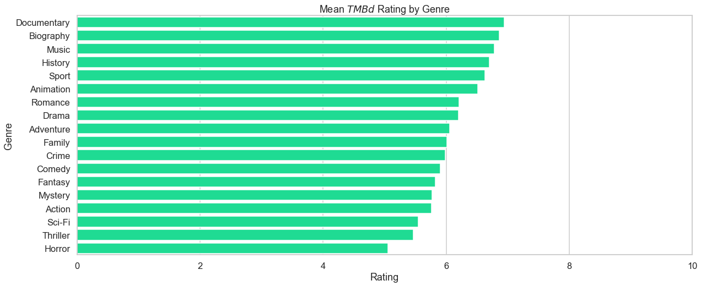
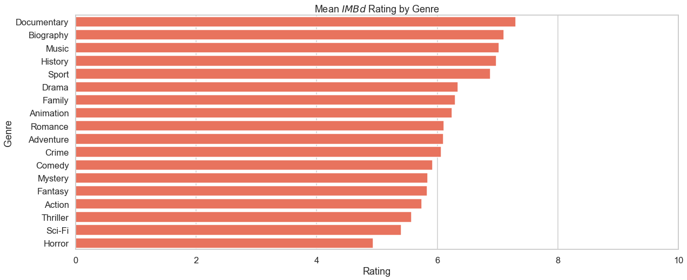
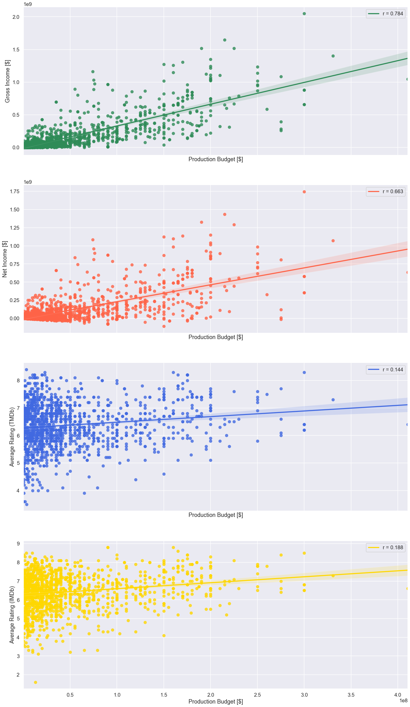

# Movie Performance Analysis

### **Author**: Suleyman Qayum

<br>

## Overview

This analysis is intended to guide the Microsoft movie studio in its decision regarding which types of films to produce. The purpose of this analysis is to identify which kinds of movies are high-performers, and the extent to which performance depends on a film's production budget. A film's performance will be determined with respect to two main categories: financial performance and ratings. 

<br>

## Business Problem

This analysis addresses the following questions:

> *1. Which genres of film perform the best financially?*   

> *2. Which genres of film have the highest ratings?*   

> *3. Does a film's financial performance and/or ratings depend on its production budget?*


In the context of this analysis, a film's financial performance measures how profitable it is by accounting for: *gross income*, *production budget*, *net income*, and *efficiency (cost-to-income ratio)*. On the other hand, a film's ratings are determined via *average user ratings in datasets extracted from the IMDb (International Movie Database) and TMDb (The Movie Database)*.

The first two questions in this analysis are answered based on the premise that *genre* is a category by which movies should be distinguished when analyzing performance. An analysis which does not account for genre ignores the fact that different genres appeal to different demographics, and it follows that insights into movie performance gained from such an analysis will be misleading. In addition, due to differences in popularity of each genre, the average production budget is not the same across genres. However, this does not entirely preclude low financial performance or low ratings. For example, a given genre could have a lower average net income than some other genre, but have a higher gain per dolar spen on production (lower cost-to-income ratio) and better average rating. Therefore, all performance analysis is carried out on data grouped by genre. 

As for the last question, the effect of production budget on performance should not depend on a film's genre. Common sense tells us that a higher production budget should lead to better results for a film, regardless of its genre. Therefore, the data is not grouped by genre during this part of the analysis.

<br>

## Data

The data used for this analysis is a collection of CSV files located in the [data](./data) subdirectory.

The `imdb.title.basics.csv` dataset assigns a unique movie ID to over 140,000 films, in addition to listing their title, year of release, runtime, and genres. After the column containing movie runtimes was discarded, this dataset was used to create the `titleyear_to_id_map` and `id_to_genre_map` DataFrames --`titleyear_to_id_map` is a  a table by which the `title` + `year` of a movie in a DataFrame without unique identifiers was mapped to its *IMDb*-designated ID  and `id_to_genre_map` is a table by which each movie ID is mapped to a list containing its associated genres.

The `imdb.title.ratings.csv` and `tmdb.movies.csv` files contains data from which the *IMDb* average rating and *TMDb* average rating were obtained for each movie ID. Both files contain a data column indicating the number of votes behind each average rating, which was used to filter out average ratings (by requiring an average rating to have at least 10 votes). This column was then discarded after the filtering was complete.

Finally, the `tn.movie_budgets.csv` dataset was the source of all financial data used in the analysis. It contains the production budget and gross income (both domestic and worldwide) of over 5,000 films. The worldwide gross income was taken as the total gross income for each film, and the column listing domestic gross incomes was discarded.

<br>

## Methods

### *Data Preparation*

While addressing Questions 1 and 2, datasets that did not have a column listing *IMDb* movie ID's (i.e. datasets not sourced from *IMDb*) were first re-indexed by movie `title` + `year`, and then  joined with the `titleyear_to_id_map` DataFrame. This process allowed the *IMDb* movie ID's to be mapped onto all other datasets. This process, in turn, allowed the genres associated with each movie ID to be mapped onto these datasets by performing another join with the `id_to_genre_map` DataFrame. 

Furthermore, while addressing Question 3, the `id_to_financials_map`, `id_to_tmdb_rating_map`, and `id_to_imdb_rating_map` DataFrames (the cleaned versions of `tn.movie_budgets.csv`, `tmdb.movies.csv`, and `imdb.title.ratings.csv` respectively) were used to map production_budget, gross income, net income, cost-to-income ratio, *TMDb* average rating, and *IMDb* average rating to their associated movie ID.

### *Descriptive Analysis*

With respect to Question 1, three boxplots were created to illustrate the distributions of gross income, net income, and cost-to-income ratio by genre. A boxplot was used rather than a bar chart to highlight the spread of each feature's distribution. In addition, the median had to be used as a measure of central tendency for these features because they were all highly skewed.

For Question 2, two bar charts were made depicting the *TMBd* and *IMBd* mean average rating by genre. The mean was used here because both ratings were distributed normally for all genres.

As for Question 3, four linear regression plots were created to depict the correlation of production budget with gross income, net income,  *TMDb* average rating, and *IMDb* average rating. The cost-to-income ratio feature was omitted because it contained a large number of outliers and did not produce a meaningful regression plot.

<br>

## Results

### *Question 1*

With respect to gross income and net income, animated movies clearly perform best, followed by adventure and sci-fi films, as their median net incomes are significantly higher than the rest of the genres. These distributions have more spread than all other genres, and so their medians are less representative as a measure of central tendency. However, the majority of data within their IQR's lies above the median net income of all other genres, making them the most profitable. This finding is highlighted in the boxplot depicting the relationship between net income and genre, as shown below:



In terms of cost-to-income rato, mystery and horror films perform best. It follows that, for films with smaller production budgets and gross incomes, mystery and horror films perform best in terms of income per dollar spent on production. Followed closely behind these two are animation, sci-fi, and adventure films, providing further evidence that films of these genres are the most profitable. These findings are highlighted in the boxplot depicting the relationship between cost-to-income ratio and genre, as shown below:


<br>

### *Question 2*

With respect to rating, the highest performers are documentaries, in addition to biographies and films related to music, history, and sports. This is true for both the *IMDb* and *TMDb*  mean ratings, as their distribution are strikingly similar. However, these genres do not overlap at all with the highest financial performers discussed above. This finding is highlighted in the bar graphs depicting the relationship between genre and mean *TMDb/IMDb* rating, as shown below:



<br>



<br>

### *Question 3*

A film's production budget correlates strongly with gross income and net income, meaning that the profitability of a movie is likely to increase as the amount of money allocated for its production increases, and vice versa. Surprisingly, rating shows a weak correlation with production budget. This implies that increasing the budget for movie production, although likely to increase profit, does not ensure that viewers will enjoy the film itself. These findings are highlighted in the regression plots depicting the relationship between budget and performance, as shown below:



<br>

## Conclusions

Given a large production budget, the best choices to consider for movie genre, financially, are animation, adventure, and sci-fi movies since they have the highest median gross incomes and median net incomes among all genres. Given a smaller production budget, mystery and horror films are the most likely to perform the best financially, with the lowest cost-to-income ratios among all genres. In terms of audience enjoyment, documentaries, along with biographies, music-related movies, historical movies, and sports-related movies recieve the highest ratings. However, none of these genres are high-performers financially, and so are not good choices in terms of profit. Finally, production budget should be regarded as a major factor when producing a film. It shows strong correlation with gross income and net income.

<br>

## Limitations & Ideas for Further Analysis

This limitations of this analysis stem mainly from the datasets themselves. The dataset containing financial information had data for only around 5,000 films, however, due to the nature of the analysis, only about 1,500 movies were able to used in the analysis. Also, production budgets and incomes, as reported by movie production agencies, are notorious for being exegerrated, and so some of this data is not reliable. Gross incomes and production budgets of a wider variety of films should therefore be collected. Further analysis should focus specifically on films that were financially successful, in order to search for, and gain insight into, the factors that led to this success. For example, determining which directors, writers, and actors are most  involved in these financially high-performing films. Another idea for analysis could involve classifying the tropes (i.e. the manner in which certain characters, settings, and situations are used in a given genre) that correlate the most highly with financial success.

Additionally, financial performance did not correlate with *TMDb* and *IMDb* ratings, which rendered these ratings ineffective as a measure of performance. The correlation between ratings from other sources and financial performance should be investigated more thoroughly because it is impractical to rely solely on financial data as an indicator of success. For example, ratings from *Rotten Tomatoes* could be investigated as a potential metric for performance.

<br>

## Further Information

Review the full analysis in the [ Jupyter Notebook](./movie-performance-analysis.ipynb) or the view the [Presentation](./Movie_Performance_Analysis_Presentation.pdf).

*For any additional questions, please contact:* 

> **Suleyman Qayum (sqayum33@gmail.com)**

<br>

## Repository Structure

```                                
├── data
    ├── imdb.title.basics.csv
    ├── imdb.title.ratings.csv
    ├── tmdb.movies.csv
    └── tn.movie_budgets.csv
├── images
    ├── budget_correlations_with_performance.png
    ├── cost_income_ratio_by_genre.png
    ├── gross_income_by_genre.png
    ├── imdb_rating_by_genre.png
    ├── net_income_by_genre.png
    └── tmdb_rating_by_genre                
├── Movie_Performance_Analysis_Presentation.pdf     
├── movie-performance-analysis.ipynb
├── PROJECT_DESCRIPTION.md
└── README.md     
```
